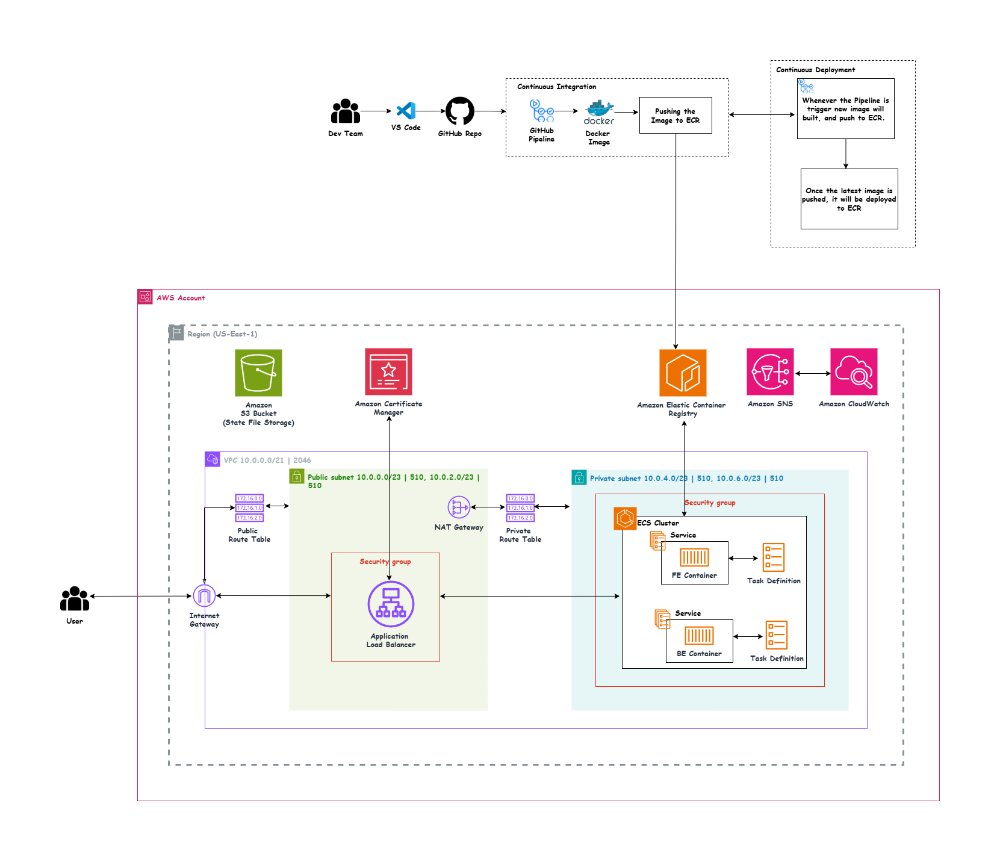

# Simple Prod Web Application — Terraform Infrastructure
This project provisions a modular, reusable AWS platform using ECS Fargate, Application Load Balancer, VPC networking, ECR, IAM, CloudWatch, and ECS Service Auto Scaling.

---

# Overview

The infrastructure follows a production deployment pattern for containerised workloads.

Architecture components:

- AWS ECS Fargate for container orchestration
- Separate ECS services for **Web** and **API**
- Application Load Balancer (ALB) with path-based routing
- Public / Private subnet design across multiple Availability Zones
- Amazon ECR for container image storage
- CloudWatch for logs and metrics
- ECS Service Auto Scaling
- Terraform remote state backend (S3)
- IAM least-privilege access model

All infrastructure resources are managed entirely through Terraform with a modular design.

---

# Architecture

**

Example flow:

```text
Internet
   │
   ▼
Application Load Balancer (ALB)
   ├── /        → Web ECS Service
   └── /api/*   → API ECS Service

ECS Fargate
   ├── Web Service
   └── API Service

Supporting Infrastructure
├── VPC
│   ├── Public Subnets
│   ├── Private Subnets
│   ├── Internet Gateway
│   ├── NAT Gateway
│   └── Route Tables
│
├── Amazon ECR
├── CloudWatch
├── IAM
└── Terraform S3 Backend
```

---

# Repository Structure

```text
.
├── main.tf
├── local.tf
├── variables.tf
├── terraform.tfvars
├── provider.tf
├── backend.tf
│
└── modules/
    ├── alb/
    ├── autoscaling/
    ├── cloudwatch/
    ├── ecr/
    ├── ecs/
    ├── eip/
    ├── iam/
    ├── internet_gateway/
    ├── nat_gateway/
    ├── route_table/
    ├── security_group/
    ├── subnet/
    └── vpc/
```

---

# Requirement Mapping

| Requirement | Implementation |
|-------------|----------------|
| Dockerised Application | Container images stored in Amazon ECR |
| Terraform Infrastructure | Fully modular Terraform codebase |
| VPC with Public / Private Subnets | Implemented across multiple AZs |
| Load Balancer | Application Load Balancer (ALB) |
| Multi-Instance Deployment | Separate ECS services with multiple running tasks |
| Auto Scaling | ECS Service Auto Scaling |
| CI/CD | GitHub Actions / GitLab CI design |
| Monitoring | CloudWatch Logs + ECS Metrics |

---

# Design Decisions

## Terraform-Only Infrastructure

All AWS resources are provisioned through Terraform.

No manual console configuration is required.

Infrastructure state is stored remotely using an S3 backend to support collaborative workflows and consistent deployments.

---

## Modular Architecture

Infrastructure components are separated into reusable Terraform modules.

Each module owns a single responsibility:

- VPC
- Networking
- Security Groups
- IAM
- ECS
- ECR
- ALB
- Auto Scaling
- Monitoring

This approach improves:

- readability
- maintainability
- reusability
- environment portability

---

## local.tf as the Orchestration Layer

`local.tf` acts as the abstraction layer between variables and module outputs.

It aggregates:

- subnet IDs
- security group IDs
- role ARNs
- target group ARNs
- ECS service configuration

This keeps `main.tf` clean and avoids hardcoded references.

The structure also allows new services to be introduced through configuration changes rather than infrastructure duplication.

---

## ECS Fargate

ECS Fargate was selected instead of EC2-backed ECS.

Reasons:

- no EC2 lifecycle management
- no AMI patching
- no node capacity planning
- reduced operational overhead
- serverless container execution model

Tasks run inside private subnets without public IP assignment.

Outbound traffic (image pulls, CloudWatch communication) uses the NAT Gateway.

---

## Separate ECS Services

The application is deployed using **two independent ECS services**:

### Web Service

Serves frontend traffic.

### API Service

Serves backend API requests.

This separation provides:

- independent deployments
- independent scaling
- better fault isolation
- cleaner service ownership

---

## ALB Path-Based Routing

A single Application Load Balancer is used.

Routing rules:

```text
/        → Web Service
/api/*   → API Service
```

Using a single ALB reduces infrastructure cost while maintaining traffic separation.

---

## ECS Service Auto Scaling

ECS Service Auto Scaling is configured for workload elasticity.

Services scale dynamically based on utilisation thresholds.

Benefits:

- automatic capacity adjustment
- improved availability under load
- cost optimisation during low-traffic periods

---

## Standardised Resource Tagging

All resources receive:

- Project
- Environment

along with resource-specific `Name` tags.

Benefits:

- cost allocation
- operational visibility
- governance support
- simplified AWS Cost Explorer reporting

---

# Trade-offs Considered

| Decision | Trade-off |
|------------|------------|
| Single ALB with path-based routing | Reduces cost by avoiding multiple load balancers. Trade-off: both services share the same listener layer. |
| ECS Fargate over EC2 | Eliminates server management overhead but may have higher per-task cost than EC2 Spot capacity. |
| ECS Service Auto Scaling | Improves elasticity but introduces additional scaling policy tuning requirements. |
| Single NAT Gateway | Cost-optimised approach. Trade-off: outbound internet dependency on a single NAT resource. |
| Modular Terraform Design | Improves maintainability and reuse but increases module orchestration complexity. |
| Separate ECS Services | Better isolation and independent scaling at the expense of additional configuration complexity. |

---

## Cost Optimisation Approach

Several decisions were made with cost efficiency in mind:

- Single ALB instead of separate load balancers
- Single NAT Gateway deployment
- ECS Fargate to avoid idle EC2 capacity
- Auto Scaling to dynamically adjust task count
- CloudWatch log retention configuration
- Modular design supporting environment-specific right-sizing

Additional optimisation opportunities:

- Use **Fargate Spot** for non-production workloads
- Reduce minimum task count during off-peak hours
- Add scheduled scaling policies
- Apply ECR lifecycle policies to limit image retention

---

# AWS Pricing Calculator

A detailed infrastructure cost estimate was created using the AWS Pricing Calculator.

[View Cost Estimate](https://calculator.aws/#/estimate?id=b7f60d20baf4880b7293347d65cb35882668711e)

---

# Prerequisites

Before deployment, ensure the following requirements are met:

- Terraform
- AWS CLI configured
- Docker installed
- Appropriate AWS IAM permissions
- S3 bucket created for Terraform remote state

---

# Usage

## Initialise Terraform

Downloads required providers and modules.

```bash
terraform init
```

---

## Validate Configuration

```bash
terraform validate
```

---

## Preview Changes

```bash
terraform plan
```

---

## Deploy Infrastructure

```bash
terraform apply
```

---

## Destroy Infrastructure

```bash
terraform destroy
```

---

# Container Image Deployment

## Authenticate to Amazon ECR

```bash
aws ecr get-login-password --region us-east-1 | \
docker login \
--username AWS \
--password-stdin <account-id>.dkr.ecr.us-east-1.amazonaws.com
```

---

## Build Docker Image

```bash
docker build -t si-prod-web .
```

---

## Tag Image

```bash
docker tag si-prod-web:latest \
<account-id>.dkr.ecr.us-east-1.amazonaws.com/si-prod-web:v1.0.0
```

---

## Push Image

```bash
docker push \
<account-id>.dkr.ecr.us-east-1.amazonaws.com/si-prod-web:v1.0.0
```

---

## Update Terraform Variables

Update image references in `terraform.tfvars`.

Example:

```hcl
web_container_image = "<account-id>.dkr.ecr.us-east-1.amazonaws.com/si-prod-web:v1.0.0"

api_container_image = "<account-id>.dkr.ecr.us-east-1.amazonaws.com/si-prod-api:v1.0.0"
```

---

## Apply Updated Deployment

```bash
terraform apply
```

ECS performs rolling deployments by default, ensuring zero-downtime updates.

---

# CI/CD Pipeline

Recommended CI/CD workflow:

```text
Push to main
    │
    ├── terraform fmt --check
    ├── terraform validate
    ├── terraform plan
    │
    └── On Merge
         ├── Docker Build
         ├── Push Images to ECR
         ├── Terraform Apply
         └── ECS Rolling Deployment
```

Typical implementation options:

- GitHub Actions
- GitLab CI
- Jenkins

Pipeline responsibilities:

- Terraform formatting validation
- Infrastructure validation
- Infrastructure deployment
- Container build and publish
- Automated ECS rollout

---

# Monitoring

## CloudWatch Logs

Dedicated log groups are configured per ECS service.

Examples:

```text
/ecs/si-prod-web
/ecs/si-prod-api
```

Configured with retention policies to control storage costs.

---

## ECS Metrics

CloudWatch provides ECS service-level metrics including:

- CPU utilisation
- Memory utilisation
- Running task count

These metrics support operational monitoring and scaling decisions.

---

## ALB Health Checks

Application Load Balancer health checks continuously validate ECS task health.

Unhealthy targets are automatically removed from traffic routing.

---

## ECS Service Auto Scaling Metrics

Auto Scaling policies use service metrics to dynamically adjust capacity.

Benefits:

- workload elasticity
- traffic responsiveness
- cost efficiency

---

# Future Improvements

Potential enhancements for a more advanced production deployment:

- HTTPS termination using ACM certificates
- AWS WAF integration
- Multi-AZ NAT Gateway deployment
- Blue/Green ECS deployments
- Terraform drift detection
- Infrastructure policy validation
- Enhanced observability with Container Insights
- Centralised dashboarding with Grafana / Prometheus

---

# Design Summary

This project demonstrates a production-style container platform built using Terraform and AWS managed services.

Key highlights:

✔ Modular Terraform design  
✔ ECS Fargate container orchestration  
✔ Separate Web and API services  
✔ ALB path-based routing  
✔ Private subnet deployment model  
✔ ECS Service Auto Scaling  
✔ CloudWatch observability  
✔ Cost-aware infrastructure decisions  
✔ CI/CD-ready deployment workflow